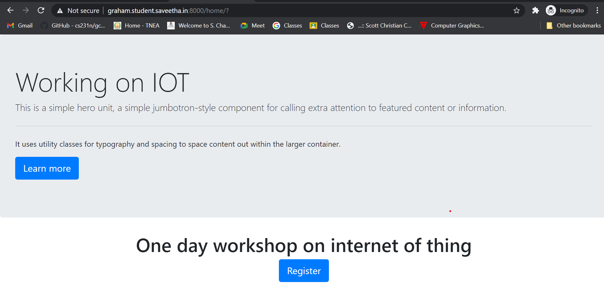
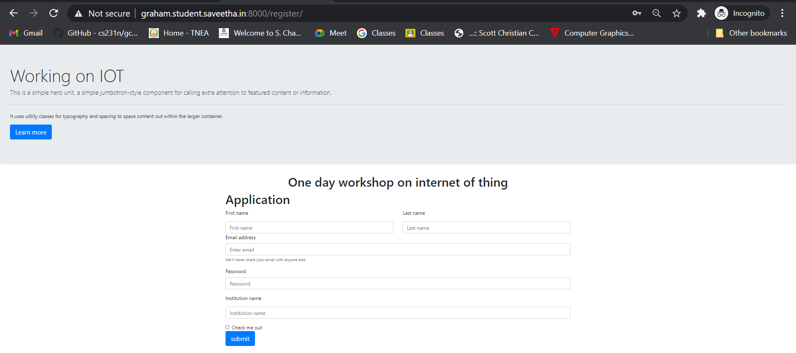
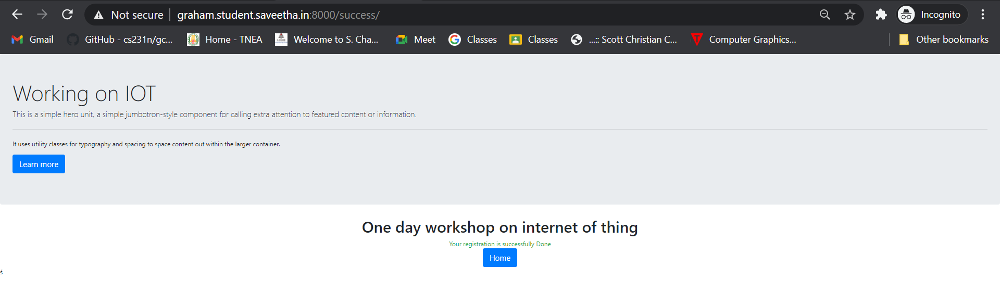
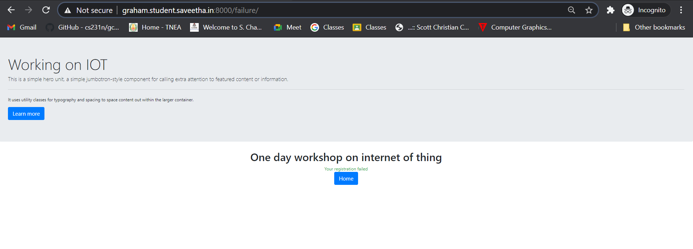
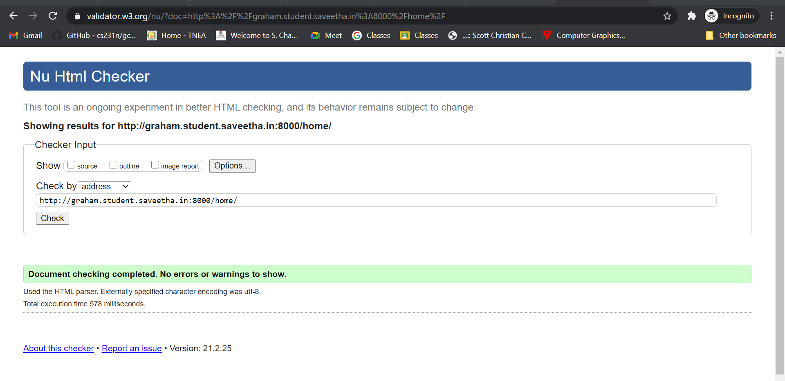

# WebApplication for Event Registration

## AIM:
To create a UX design and develop a web application for event registration.


## DESIGN SCREENS:


## WIREFRAME:


## PROTOTYPE:


## PROGRAM:
### HOME.HTML
```
<!doctype html>
<html lang="en">
  <head>
    <!-- Required meta tags -->
    <meta charset="utf-8">
    <meta name="viewport" content="width=device-width, initial-scale=1, shrink-to-fit=no">

    <!-- Bootstrap CSS -->
    <link rel="stylesheet" href="https://maxcdn.bootstrapcdn.com/bootstrap/4.0.0/css/bootstrap.min.css" integrity="sha384-Gn5384xqQ1aoWXA+058RXPxPg6fy4IWvTNh0E263XmFcJlSAwiGgFAW/dAiS6JXm" crossorigin="anonymous">

    <title>Hello, world!</title>
  </head>
  <body>
    <div class="jumbotron">
        <div class="cotainer">
            <h1 class="display-4">Working on IOT</h1>
            <p class="lead">This is a simple hero unit, a simple jumbotron-style component for calling extra attention to featured content or information.</p>
            <hr class="my-4">
            <p>It uses utility classes for typography and spacing to space content out within the larger container.</p>
            <p class="lead">
            <a class="btn btn-primary btn-lg" href="#" role="button">Learn more</a>
            </p>
        </div>
    </div>
    <div class="container">
        <div class="row">
            <div class="col-12 text-center">
                <h1>One day workshop on internet of thing</h1>
            </div>
        </div>
        <div class="row">
            <div class="col-12 text-center">
                <a href="/register/" class="btn btn-primary btn-lg" role="button">Register</a>
            </div>
        </div>
    </div>

    <!-- Optional JavaScript -->
    <!-- jQuery first, then Popper.js, then Bootstrap JS -->
    <script src="https://code.jquery.com/jquery-3.2.1.slim.min.js" integrity="sha384-KJ3o2DKtIkvYIK3UENzmM7KCkRr/rE9/Qpg6aAZGJwFDMVNA/GpGFF93hXpG5KkN" crossorigin="anonymous"></script>
    <script src="https://cdnjs.cloudflare.com/ajax/libs/popper.js/1.12.9/umd/popper.min.js" integrity="sha384-ApNbgh9B+Y1QKtv3Rn7W3mgPxhU9K/ScQsAP7hUibX39j7fakFPskvXusvfa0b4Q" crossorigin="anonymous"></script>
    <script src="https://maxcdn.bootstrapcdn.com/bootstrap/4.0.0/js/bootstrap.min.js" integrity="sha384-JZR6Spejh4U02d8jOt6vLEHfe/JQGiRRSQQxSfFWpi1MquVdAyjUar5+76PVCmYl" crossorigin="anonymous"></script>
  </body>
</html>
```
### register.HTML:
```
<!doctype html>
<html lang="en">

<head>
    <!-- Required meta tags -->
    <meta charset="utf-8">
    <meta name="viewport" content="width=device-width, initial-scale=1, shrink-to-fit=no">

    <!-- Bootstrap CSS -->
    <link rel="stylesheet" href="https://maxcdn.bootstrapcdn.com/bootstrap/4.0.0/css/bootstrap.min.css"
        integrity="sha384-Gn5384xqQ1aoWXA+058RXPxPg6fy4IWvTNh0E263XmFcJlSAwiGgFAW/dAiS6JXm" crossorigin="anonymous">

    <title>Hello, world!</title>
</head>

<body>
    <div class="jumbotron">
        <div class="cotainer">
            <h1 class="display-4">Working on IOT</h1>
            <p class="lead">This is a simple hero unit, a simple jumbotron-style component for calling extra attention
                to featured content or information.</p>
            <hr class="my-4">
            <p>It uses utility classes for typography and spacing to space content out within the larger container.</p>
            <p class="lead">
                <a class="btn btn-primary btn-lg" href="#" role="button">Learn more</a>
            </p>
        </div>
    </div>
    <div class="container">
        <div class="row">
            <div class="col-12 text-center">
                <h1>One day workshop on internet of thing</h1>
            </div>
        </div>
        <div class="row">
            <div class="col-12">
                <h1>Application</h1>
            </div>
        </div>
        <form>
            <div class="row">
                <div class="col">
                    <p>First name</p>
                    <input type="text" class="form-control" placeholder="First name">
                </div>
                <div class="col">
                    <p>Last name</p>
                    <input type="text" class="form-control" placeholder="Last name">
                </div>
            </div>
            <div class="form-group">
                <label for="exampleInputEmail1">Email address</label>
                <input type="email" class="form-control" id="exampleInputEmail1" aria-describedby="emailHelp"
                    placeholder="Enter email">
                <small id="emailHelp" class="form-text text-muted">We'll never share your email with anyone
                    else.</small>
            </div>
            <div class="form-group">
                <label for="exampleInputPassword1">Password</label>
                <input type="password" class="form-control" id="exampleInputPassword1" placeholder="Password">
            </div>
            <div class="form-group">
                <p>Institution name</p>
                <input type="text" class="form-control" placeholder="Institution name">
            </div>
            <div class="form-check">
                <input type="checkbox" class="form-check-input" id="exampleCheck1">
                <label class="form-check-label" for="exampleCheck1">Check me out</label>
            </div>
            <a href="/success/" class="btn btn-primary btn-lg" role="button" id="reg">submit</a>
        </form>
    </div>

    <!-- Optional JavaScript -->
    <!-- jQuery first, then Popper.js, then Bootstrap JS -->
    <script src="https://code.jquery.com/jquery-3.2.1.slim.min.js"
        integrity="sha384-KJ3o2DKtIkvYIK3UENzmM7KCkRr/rE9/Qpg6aAZGJwFDMVNA/GpGFF93hXpG5KkN"
        crossorigin="anonymous"></script>
    <script src="https://cdnjs.cloudflare.com/ajax/libs/popper.js/1.12.9/umd/popper.min.js"
        integrity="sha384-ApNbgh9B+Y1QKtv3Rn7W3mgPxhU9K/ScQsAP7hUibX39j7fakFPskvXusvfa0b4Q"
        crossorigin="anonymous"></script>
    <script src="https://maxcdn.bootstrapcdn.com/bootstrap/4.0.0/js/bootstrap.min.js"
        integrity="sha384-JZR6Spejh4U02d8jOt6vLEHfe/JQGiRRSQQxSfFWpi1MquVdAyjUar5+76PVCmYl"
        crossorigin="anonymous"></script>
</body>

</html>
```
### success.HTML:
```
<!doctype html>
<html lang="en">
  <head>
    <!-- Required meta tags -->
    <meta charset="utf-8">
    <meta name="viewport" content="width=device-width, initial-scale=1, shrink-to-fit=no">

    <!-- Bootstrap CSS -->
    <link rel="stylesheet" href="https://maxcdn.bootstrapcdn.com/bootstrap/4.0.0/css/bootstrap.min.css" integrity="sha384-Gn5384xqQ1aoWXA+058RXPxPg6fy4IWvTNh0E263XmFcJlSAwiGgFAW/dAiS6JXm" crossorigin="anonymous">

    <title>Hello, world!</title>
  </head>
  <body>
    <div class="jumbotron">
        <div class="cotainer">
            <h1 class="display-4">Working on IOT</h1>
            <p class="lead">This is a simple hero unit, a simple jumbotron-style component for calling extra attention to featured content or information.</p>
            <hr class="my-4">
            <p>It uses utility classes for typography and spacing to space content out within the larger container.</p>
            <p class="lead">
            <a class="btn btn-primary btn-lg" href="#" role="button">Learn more</a>
            </p>
        </div>
    </div>
    <div class="container">
        <div class="row">
            <div class="col-12 text-center">
                <h1>One day workshop on internet of thing</h1>
            </div>
        </div>
        <div class="row">
            <div class="col-12 text-center text-success">
                Your registration is successfully Done
            </div>
        </div>
        <div class="row">
            <div class="col-12 text-center">
                <a href="/home/" class="btn btn-primary btn-lg" role="button">Home</a>
            </div>
        </div>
    </div>

    <!-- Optional JavaScript -->
    <!-- jQuery first, then Popper.js, then Bootstrap JS -->
    <script src="https://code.jquery.com/jquery-3.2.1.slim.min.js" integrity="sha384-KJ3o2DKtIkvYIK3UENzmM7KCkRr/rE9/Qpg6aAZGJwFDMVNA/GpGFF93hXpG5KkN" crossorigin="anonymous"></script>
    <script src="https://cdnjs.cloudflare.com/ajax/libs/popper.js/1.12.9/umd/popper.min.js" integrity="sha384-ApNbgh9B+Y1QKtv3Rn7W3mgPxhU9K/ScQsAP7hUibX39j7fakFPskvXusvfa0b4Q" crossorigin="anonymous"></script>
    <script src="https://maxcdn.bootstrapcdn.com/bootstrap/4.0.0/js/bootstrap.min.js" integrity="sha384-JZR6Spejh4U02d8jOt6vLEHfe/JQGiRRSQQxSfFWpi1MquVdAyjUar5+76PVCmYl" crossorigin="anonymous"></script>
  </body>
</html>ś

```
### failure.HTML:
```
<!doctype html>
<html lang="en">
  <head>
    <!-- Required meta tags -->
    <meta charset="utf-8">
    <meta name="viewport" content="width=device-width, initial-scale=1, shrink-to-fit=no">

    <!-- Bootstrap CSS -->
    <link rel="stylesheet" href="https://maxcdn.bootstrapcdn.com/bootstrap/4.0.0/css/bootstrap.min.css" integrity="sha384-Gn5384xqQ1aoWXA+058RXPxPg6fy4IWvTNh0E263XmFcJlSAwiGgFAW/dAiS6JXm" crossorigin="anonymous">

    <title>Hello, world!</title>
  </head>
  <body>
    <div class="jumbotron">
        <div class="cotainer">
            <h1 class="display-4">Working on IOT</h1>
            <p class="lead">This is a simple hero unit, a simple jumbotron-style component for calling extra attention to featured content or information.</p>
            <hr class="my-4">
            <p>It uses utility classes for typography and spacing to space content out within the larger container.</p>
            <p class="lead">
            <a class="btn btn-primary btn-lg" href="#" role="button">Learn more</a>
            </p>
        </div>
    </div>
    <div class="container">
        <div class="row">
            <div class="col-12 text-center">
                <h1>One day workshop on internet of thing</h1>
            </div>
        </div>
        <div class="row">
            <div class="col-12 text-center text-success">
                Your registration failed
            </div>
        </div>
        <div class="row">
            <div class="col-12 text-center">
                <a href="/home/" class="btn btn-primary btn-lg" role="button">Home</a>
            </div>
        </div>
    </div>

    <!-- Optional JavaScript -->
    <!-- jQuery first, then Popper.js, then Bootstrap JS -->
    <script src="https://code.jquery.com/jquery-3.2.1.slim.min.js" integrity="sha384-KJ3o2DKtIkvYIK3UENzmM7KCkRr/rE9/Qpg6aAZGJwFDMVNA/GpGFF93hXpG5KkN" crossorigin="anonymous"></script>
    <script src="https://cdnjs.cloudflare.com/ajax/libs/popper.js/1.12.9/umd/popper.min.js" integrity="sha384-ApNbgh9B+Y1QKtv3Rn7W3mgPxhU9K/ScQsAP7hUibX39j7fakFPskvXusvfa0b4Q" crossorigin="anonymous"></script>
    <script src="https://maxcdn.bootstrapcdn.com/bootstrap/4.0.0/js/bootstrap.min.js" integrity="sha384-JZR6Spejh4U02d8jOt6vLEHfe/JQGiRRSQQxSfFWpi1MquVdAyjUar5+76PVCmYl" crossorigin="anonymous"></script>
  </body>
</html>
```
### LISTOFPARTICIPANTS.HTML:
```
<!doctype html>
<html lang="en">

<head>
    <!-- Required meta tags -->
    <meta charset="utf-8">
    <meta name="viewport" content="width=device-width, initial-scale=1, shrink-to-fit=no">

    <!-- Bootstrap CSS -->
    <link rel="stylesheet" href="https://maxcdn.bootstrapcdn.com/bootstrap/4.0.0/css/bootstrap.min.css"
        integrity="sha384-Gn5384xqQ1aoWXA+058RXPxPg6fy4IWvTNh0E263XmFcJlSAwiGgFAW/dAiS6JXm" crossorigin="anonymous">

    <title>Saveetha Engineering College</title>
</head>

<body>
    <div class="jumbotron">
        <div class="container">
            <h1 class="display-4">Workshop on IOT</h1>
            <p class="lead">This is a simple hero unit, a simple jumbotron-style component for calling extra attention
                to featured content or information.</p>
            <hr class="my-4">
            <p>It uses utility classes for typography and spacing to space content out within the larger container.</p>
            <p class="lead">
                <a class="btn btn-primary btn-lg" href="#" role="button">Learn more</a>
            </p>
        </div>
    </div>
    <div class="container">
        <div class="row">
            <div class="col-12">
                <h1>One day workshop on internet of thing</h1>
            </div>
        </div>
        <div class="row">
            <div class="col-12">
                <table class="table">
                    <thead>
                        <tr>
                            <th scope="col">NAME</th>
                            <th scope="col">EMAIL</th>
                            <th scope="col">PHONE</th>
                            <th scope="col">INSTITUTION</th>
                        </tr>
                    </thead>
                    <tbody>
                        
                        <tr>                          
                            <td>kamal</td>
                            <td>raja@gmail.com</td>
                            <td>234242</td>
                            <td>saveetha</td>
                        </tr>
                        
                        <tr>                          
                            <td>kamal</td>
                            <td>raja@gmail.com</td>
                            <td>234242</td>
                            <td>saveetha</td>
                        </tr>
                        
                        <tr>                          
                            <td>otto</td>
                            <td>otto@gmail.com</td>
                            <td>123</td>
                            <td>Saveetha</td>
                        </tr>
                        
                        <tr>                          
                            <td>kala</td>
                            <td>sfsd</td>
                            <td>234</td>
                            <td>sdf</td>
                        </tr>
                        
                        <tr>                          
                            <td>sdfsd</td>
                            <td>sdf</td>
                            <td>234</td>
                            <td>sdfsd</td>
                        </tr>
                        
                        <tr>                          
                            <td>fsdfsd</td>
                            <td>sdf</td>
                            <td>sdf</td>
                            <td>sdf</td>
                        </tr>
                        
                        <tr>                          
                            <td>sdf</td>
                            <td>sdf</td>
                            <td>sdf</td>
                            <td>sdf</td>
                        </tr>
                        
                        <tr>                          
                            <td>sdf</td>
                            <td>sdf</td>
                            <td>sdf</td>
                            <td>sdf</td>
                        </tr>
                        
                        <tr>                          
                            <td>sdf</td>
                            <td>sdf</td>
                            <td>sdf</td>
                            <td>sdf</td>
                        </tr>
                        
                        <tr>                          
                            <td>sdf</td>
                            <td>sdf</td>
                            <td>sdf</td>
                            <td>sdf</td>
                        </tr>
                        
                        <tr>                          
                            <td>sdf</td>
                            <td>sdf</td>
                            <td>sdf</td>
                            <td>sdf</td>
                        </tr>
                        
                        <tr>                          
                            <td>sdf</td>
                            <td>sdf</td>
                            <td>sdf</td>
                            <td>sdf</td>
                        </tr>
                        
                        <tr>                          
                            <td>sdf</td>
                            <td>sdf</td>
                            <td>sdf</td>
                            <td>sdf</td>
                        </tr>
                        
                        <tr>                          
                            <td>sdf</td>
                            <td>sdf</td>
                            <td>sdf</td>
                            <td>sdf</td>
                        </tr>
                                                
                    </tbody>
                </table>
            </div>
        </div>
        <div class="row">
            <div class="col-12 text-center">
                <a href="/home/" class="btn btn-primary btn-lg" role="button" >Home</a>
            </div>
        </div>         
    </div>

    <!-- Optional JavaScript -->
    <!-- jQuery first, then Popper.js, then Bootstrap JS -->
    <script src="https://code.jquery.com/jquery-3.2.1.slim.min.js"
        integrity="sha384-KJ3o2DKtIkvYIK3UENzmM7KCkRr/rE9/Qpg6aAZGJwFDMVNA/GpGFF93hXpG5KkN"
        crossorigin="anonymous"></script>
    <script src="https://cdnjs.cloudflare.com/ajax/libs/popper.js/1.12.9/umd/popper.min.js"
        integrity="sha384-ApNbgh9B+Y1QKtv3Rn7W3mgPxhU9K/ScQsAP7hUibX39j7fakFPskvXusvfa0b4Q"
        crossorigin="anonymous"></script>
    <script src="https://maxcdn.bootstrapcdn.com/bootstrap/4.0.0/js/bootstrap.min.js"
        integrity="sha384-JZR6Spejh4U02d8jOt6vLEHfe/JQGiRRSQQxSfFWpi1MquVdAyjUar5+76PVCmYl"
        crossorigin="anonymous"></script>
</body>

</html>
```

## OUTPUT:






## VALIDATION REPORT:


## RESULT:
Thus an UX design and a web application has been devloped for event registration. It is hosted in the URL http://graham.student.saveetha.in:8000/home/ . HTML code is validated.